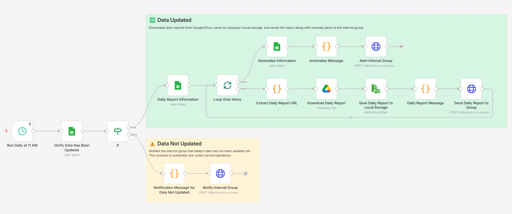

# 📋 Customer Service Daily Report — Automated Pipeline

> **Eliminated 3 hours of daily manual work** — CS data flows automatically from PostgreSQL to a fully formatted Google Sheet report, delivered to the team via Signal every morning.

---

## 🔍 The Problem

The Customer Service department required a comprehensive daily report covering customer inquiry volume, question categorization, AI chatbot performance, VIP user distribution, emotional member tracking, first response time, and average conversation handling time. Previously, a CS staff member had to:

1. Log in to the company's internal data portal
2. Manually download multiple datasets
3. Build the report from scratch every day

This process took **~3 hours per day** — repetitive, error-prone, and time-consuming.

## ✅ The Solution

A fully automated multi-stage pipeline that pulls, processes, and delivers the complete CS daily report with no manual work. CS staff now only do what only they can do: **write the qualitative commentary**, using their frontline knowledge of what actually happened that day. Everything else is automated.

The pipeline handles:
- Retrieving CS data through SQL joins across different PostgreSQL tables
- Calculating daily changes, VIP breakdowns, and trend comparisons
- Formatting and populating a live Google Sheet report
- Pulling in CS staff comments via `=IMPORTRANGE` from a separate input sheet
- Delivering the report link to the team Signal group every morning

---

## 🏗️ Architecture Overview

```
┌──────────────────────────────────────────────────────────────────────┐
│              CS DAILY REPORT AUTOMATION PIPELINE                     │
└──────────────────────────────────────────────────────────────────────┘

  [Windows Task Scheduler]
       │  Triggers daily at scheduled time
       ▼
  [Python Script]
       │  Connects to company PostgreSQL database
       │  Runs SQL queries across multiple CS data tables
       │  Cleans, calculates, and formats the data
       ▼
  [Google Drive]
       │  Saves processed daily data file
       ▼
  [Google Apps Script]  (Time-based trigger)
       │  Reads new data file from Google Drive
       │  Updates the master report Google Sheet:
       │    → Inbound volume & 7-day trend
       │    → Question type breakdown & daily change %
       │    → VIP-level distribution per question category
       │    → AI chatbot performance (handling rate, transfer rate)
       │    → Top 15 closure reasons
       │    → Emotional member  summaries
       │    → AI vs human response time & stability analysis
       ▼
  [=IMPORTRANGE] ──────────────────────────────────────────────────┐
       │  CS staff write qualitative comments in a                 │
       │  separate input Google Sheet (their familiar interface)   │
       │  Comments are pulled automatically into the report        │◄─ CS Staff Input
       ▼                                                           │
  [n8n Workflow]                                                   │
       │                                                           │
       ├── Verify: Has today's data been updated?                  
       │                                                           │
       ├── YES ──► Fetch report Google Sheet URL                   │
       │                ▼                                          │
       │           Save report copy to NAS (backup)                │
       │                ▼                                          │
       │           Compose Signal message with date + report link  │
       │                ▼                                          │
       │           Send to CS team Signal group                    │                                                                │                                                           │ 
       └── NO  ──► Send alert to Signal group: "Data not updated"  │
```

---

## 📊 What the Report Covers

The automated report replicates and extends what previously took 3 hours of manual work:

| Section | Details |
|---|---|
| **Inbound Volume** | Daily total, 7-day trend chart, comparison to 7-day average |
| **Question Classification** | 6 categories |
| **Daily Change Rates** | Day-on-day % change per category with ▲▼ indicators |
| **VIP Distribution** | Question breakdown across VIP0–VIP10 + guest users |
| **Top 15 Closure Reasons** | Ranked by volume with AI/human/transfer splits |
| **AI Chatbot Performance** | AI independent handling rate, transfer rate, daily & 7-day trend |
| **AI vs Human Analysis** | Response time, message count median, stability variance per category |
| **First Deposit Conversion** | Daily conversion stats vs. prior day |
| **Emotional Members** | Count by type (complaint / verbal abuse / threat), VIP breakdown |
| **CS Staff Commentary** | Qualitative notes written by CS staff, auto-imported via `=IMPORTRANGE` |

---

## ⚙️ Tech Stack

| Layer | Tool | Purpose |
|---|---|---|
| Scheduling | Windows Task Scheduler | Trigger pipeline at a fixed daily time |
| Data Extraction | Python + psycopg2 | Query PostgreSQL, process & export data |
| Cloud Storage | Google Drive API | Transfer daily data file to cloud |
| Report Population | Google Apps Script | Update all report sections in Google Sheet |
| Staff Commentary | Google Sheets `=IMPORTRANGE` | Pull CS-written comments from input sheet |
| Workflow & Delivery | **n8n** | Verify update, compose message, send to Signal |
| Backup | Synology NAS | Archive daily report copy via n8n |
| Delivery | Signal Messenger API | Notify CS team with report link |

---

## 🤖 n8n Workflow Breakdown

The n8n workflow handles the final stage of the pipeline — verifying the report is ready, then delivering it to the team.

### Workflow Screenshot



> The n8n workflow automates the daily report distribution pipeline — verifying data readiness, downloading and storing reports, and notifying the internal group with both the report and any anomaly alerts.

### Logic Flow

```
[Scheduled Trigger — Daily at 11 AM]
    |
    ▼
[Verify Data Has Been Updated]
    |
    |— YES —→ [Fetch Daily Report Information from Sheet]
    |               |
    |               ▼
    |          [Loop Over Each Report Item]
    |               |
    |               |— loop —→ [Extract Daily Report URL]
    |               |               |
    |               |               ▼
    |               |          [Download Daily Report]
    |               |               |
    |               |               ▼
    |               |          [Save Report to Local Storage]
    |               |               |
    |               |               ▼
    |               |          [Compose Daily Report Message]
    |               |               |
    |               |               ▼
    |               |          [Send Report to Internal Group]
    |               |
    |               |— done —→ [Fetch Anomalies Information from Sheet]
    |                               |
    |                               ▼
    |                          [Compose Anomaly Alert Message]
    |                               |
    |                               ▼
    |                          [Alert Internal Group]
    |
    |— NO  —→ [Compose Data Not Updated Message]
    (rare)          |
                    ▼
               [Notify Internal Group]
```

---

## 💡 Design Decision: Why AI Doesn't Write the Commentary

A deliberate choice was made not to use an AI to generate the daily written commentary — and it's worth explaining why.

The CS daily report includes qualitative explanations for data anomalies that require real operational context — things like why a certain query category spiked that day, or what caused an unusual pattern in the numbers. This requires frontline knowledge of what actually happened: system events, specific issues raised by users, or operational changes that only the CS team would know about. An AI cannot reliably generate this. It would either hallucinate specifics or produce generic filler that adds no value.

Instead, the system is designed so that CS staff write their comments in a simple, familiar Google Sheet (their input sheet), and =IMPORTRANGE pulls those comments automatically into the report. Staff time is spent on judgment, not on data formatting.

Where AI is integrated: The pipeline uses the AI chatbot performance data (AI independent handling rate, transfer rate, response time variance) as core report metrics — tracking and reporting how the AI chatbot is performing daily. This creates a feedback loop for improving the chatbot's prompts and handling logic over time.

---

## 📈 Results & Impact

| Metric | Before | After |
|---|---|---|
| Daily report preparation time | **~3 hours** (manual) | **~0 min** (fully automated) |
| Data entry errors | Present (manual copy-paste) | **Eliminated** |
| Report delivery time | Dependent on staff availability | **Fixed daily schedule** |
| Staff time spent | 3 hrs on data formatting | **Spent only on qualitative commentary** |
| Report consistency | Varied by person | **Standardised every day** |

---

## 🔑 Key Concepts Demonstrated

- ✅ **Multi-system integration** — PostgreSQL → Google Drive → Google Sheets → n8n → Signal → NAS
- ✅ **Low-code orchestration** — n8n workflow with conditional branching and failure alerting
- ✅ **Scripting** — Python for data extraction/processing, Google Apps Script for report population
- ✅ **Human-in-the-loop design** — `=IMPORTRANGE` lets domain experts contribute commentary without touching the pipeline
- ✅ **Error handling** — separate alert branch fires if upstream data is not updated in time
- ✅ **AI performance tracking** — daily monitoring of AI chatbot handling rate and response efficiency built into the report itself

---

## 👤 Author

**Yew Kok Tang**
AI & Automation Specialist
[LinkedIn](https://linkedin.com/in/yewkoktang) · [Email](yktang93@yahoo.com)

